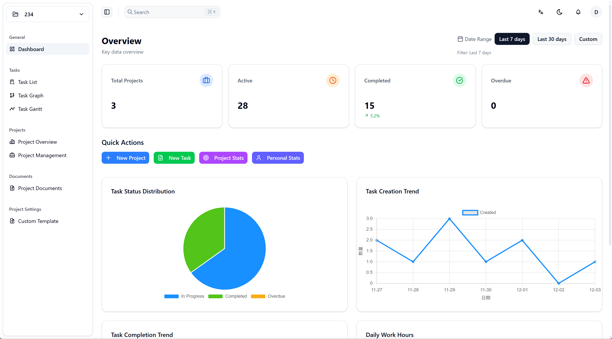
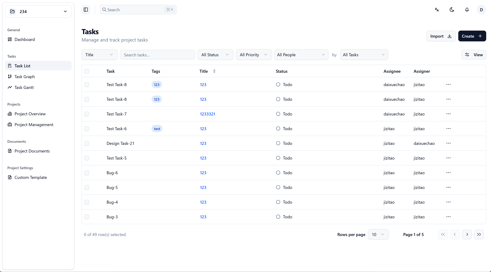
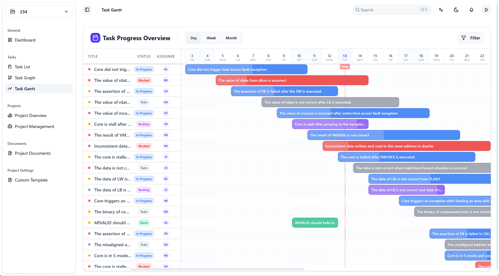
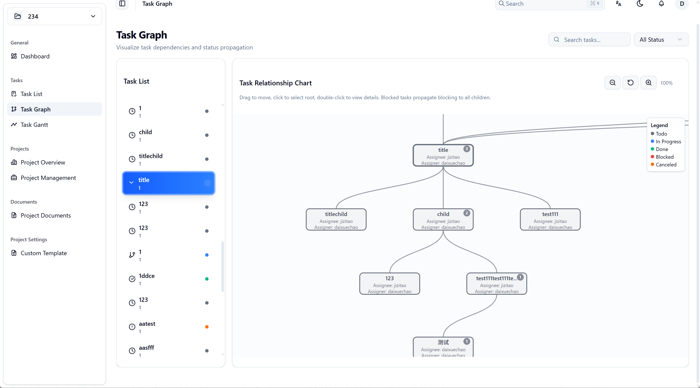

<p align="center" style="display: flex; align-items: center; justify-content: center;">
  
</p>

# TaskStream

一个面向任务流转的敏捷项目管理工具，以任务单（Task）为甲乙双方的契约形式进行状态跟踪与交互记录。

任务单之间可以无关联，也可以按父子关系（父任务、子任务）进行组合；并由此衍生出父、子工程的更大更复杂的任务组织关系。可见性权限上分为两种：1、普通开发者（Project Member）仅可见与自己有关的任务单和相应数据信息（无论自己是甲方（Assigner）或乙方（Assignee）），简洁、清晰、明了、聚焦；2、项目拥有者（Project Leader）可见所有成员的任务单和其他相应数据信息，全面、凝练、清晰、敏捷。

从操作界面来讲，TaskStream（TS）提供任务、项目、模板、用户、文档、看板、甘特图、态势仪表盘等模块示例。

TS的核心要义在于敏捷精炼、聚焦任务、减少纠缠、明确需求与目标、明确责任范围并记录所有活动动作。TS非常适用于追求简洁、务实、任务交付承诺为导向的敏捷开发管理工作。

希望你能享受它给你带来的便利！

<p align="center" style="display: flex; align-items: center; justify-content: center;">
  
  
</p>
<p align="center" style="display: flex; align-items: center; justify-content: center;">
  
  
</p>

## 技术栈

- React + TypeScript（Vite 7 开发与构建）
- Tailwind CSS v4（`@tailwindcss/vite` 插件集成）
- Radix UI + Shadcn 风格组件（位于 `src/components/ui`）
- TanStack Router（代码拆分、声明式路由）与 TanStack Query（数据请求管理）
- Zustand（轻量状态管理）
- Zod（数据校验）、React Hook Form（表单）
- Vitest + Testing Library（单元测试）

## 快速开始

1. 安装依赖

```bash
npm install
```

2. 启动开发服务

```bash
npm run dev
```

3. 构建与本地预览

```bash
npm run build
npm run preview
```

建议使用 Node.js 18+。

## 环境变量

- 复制 `.env.example` 为 `.env`，根据需要调整：

```env
VITE_API_BASE_URL=http://localhost:3000/api
```

- 开发环境默认使用 Vite 代理：当未设置 `VITE_API_BASE_URL` 时，HTTP 客户端基址为 `/api`，由开发服务器代理到后端。
- WebSocket 开发地址通过 `vite.config.ts` 的 `/ws` 代理到后端。


## 常用命令

- `npm run dev` 启动开发
- `npm run build` 构建生产包
- `npm run preview` 本地预览构建产物
- `npm run lint` 代码检查（ESLint）
- `npm run format`/`format:check` 代码格式化（Prettier）
- `npm run test` 运行测试（Vitest）

## 项目结构概览

```
fronted/
├─ src/
│  ├─ components/        # 复用 UI 与业务组件
│  ├─ features/          # 功能模块（tasks、projects、users、templates 等）
│  ├─ routes/            # TanStack Router 路由文件
│  ├─ lib/               # 请求、工具、i18n、ws 等基础库
│  ├─ stores/            # Zustand 状态
│  ├─ utils/             # 通用工具方法
│  ├─ main.tsx           # 应用入口
│  └─ index.css          # 全局样式
├─ index.html            # 应用模板
├─ vite.config.ts        # Vite 配置与代理
├─ vitest.config.ts      # 测试配置
└─ package.json
```

入口与路由：
- [main.tsx](file:///d:/workspace/task-stream/fronted/src/main.tsx) 初始化 `QueryClient`、主题与字体上下文，并挂载 `RouterProvider`。
- 路由由插件生成到 [routeTree.gen.ts](file:///d:/workspace/task-stream/fronted/src/routeTree.gen.ts)，路由文件位于 `src/routes`。

## 功能模块示例

- 认证：登录、注册、忘记密码、OTP（`src/features/auth`）
- 任务：列表/详情/评论/附件/导入（`src/features/tasks`）
- 项目：创建/成员/概览/设置（`src/features/projects`）
- 模板与自定义字段（`src/features/templates`）
- 用户管理与数据表格（`src/features/users`）
- 文档管理（`src/features/documents`）
- 看板与甘特图（`src/features/kanban`、`src/features/gantt`）
- 仪表盘与统计（`src/features/dashboard`）

## UI 与样式

- Tailwind CSS v4，已启用 `@tailwindcss/vite` 插件。
- 基础 UI 组件封装在 `src/components/ui`，遵循 Radix UI 交互语义。

